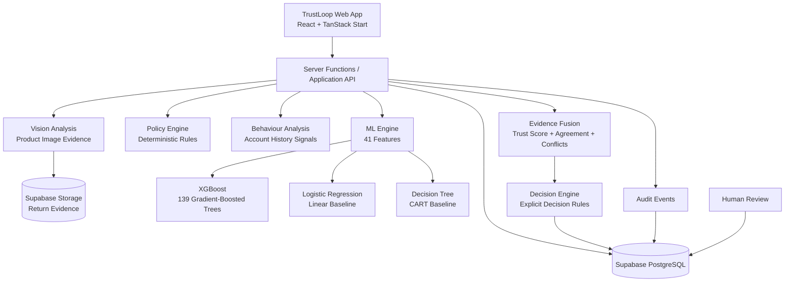
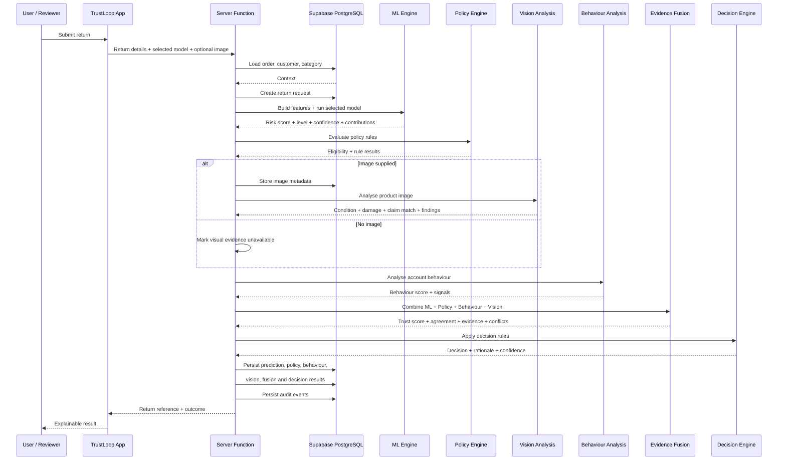
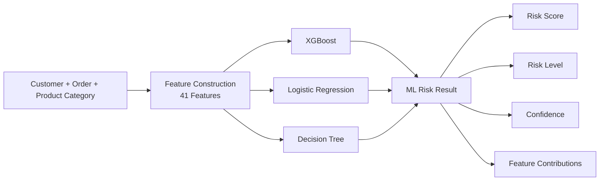
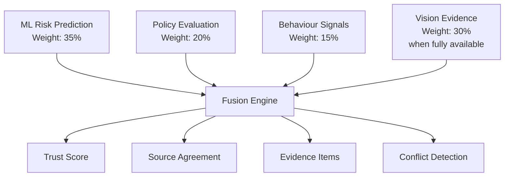
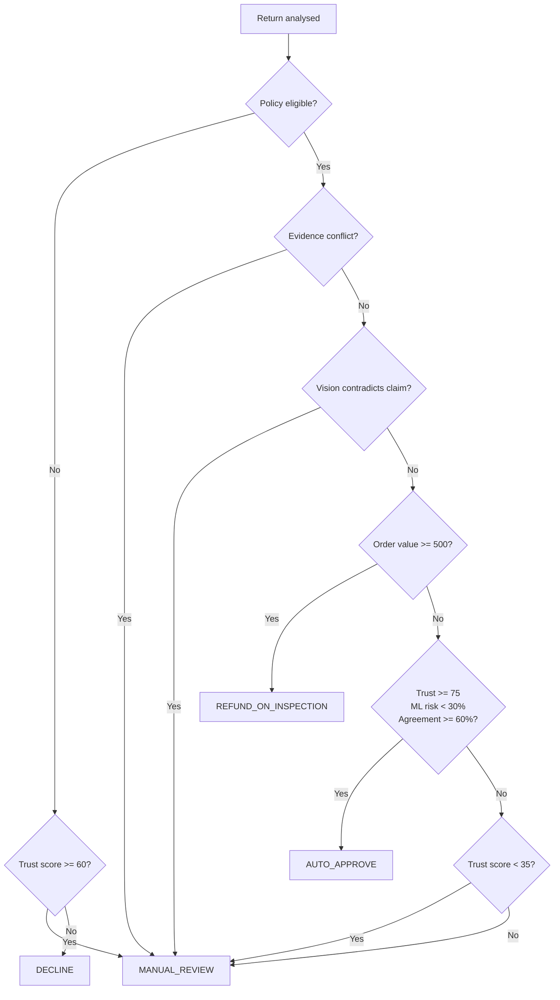
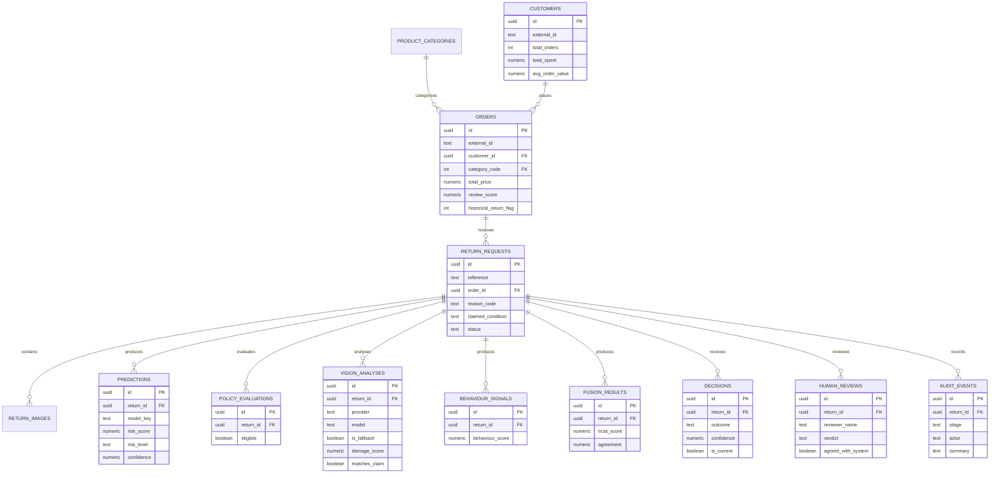
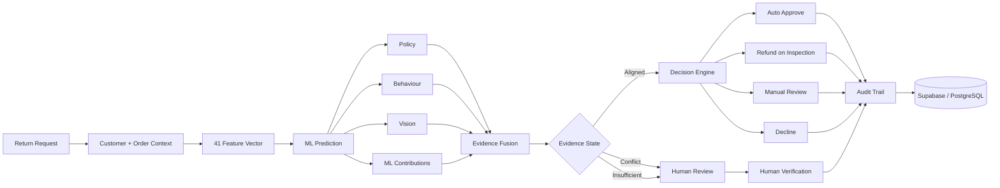

# TrustLoop

## The Intelligent Trust Layer for E-Commerce Returns

> **ML predicts. Evidence explains. Humans verify.**

TrustLoop is an evidence-driven return decision platform for e-commerce. It evaluates a return using machine-learning risk prediction, deterministic return-policy checks, customer behaviour signals, and product-image evidence before producing a decision.

The central idea is simple:

> **A return decision should not depend on a single number.**

TrustLoop therefore treats the ML prediction as one signal. The system combines it with other evidence, identifies conflicts, and routes uncertain cases to human review.

---

## Why TrustLoop?

Traditional return systems often reduce a case to a single risk score. That can make the decision difficult to explain and can create problems when different pieces of evidence disagree.

TrustLoop creates a complete decision trail:

```text
Return Request
      |
      v
Customer + Order + Product + Return Details
      |
      v
41-Feature ML Risk Prediction
      |
      +------------------+------------------+------------------+
      |                  |                  |                  |
      v                  v                  v                  v
   Policy            Behaviour           Vision          ML Evidence
   Rules             Signals          Product Image       Contribution
      |                  |                  |                  |
      +------------------+------------------+------------------+
                                 |
                                 v
                         Evidence Fusion
                                 |
                  +--------------+--------------+
                  |              |              |
                  v              v              v
               Aligned        Conflict     Insufficient
                  |              |              |
                  |              +-------> Human Review
                  |                             |
                  +-----------------------------+
                                 |
                                 v
                          Decision Engine
                                 |
          +----------------------+----------------------+
          |                      |                      |
          v                      v                      v
    Auto-Approve          Refund on Inspection    Human Investigation
          |                      |                      |
          +----------------------+----------------------+
                                 |
                                 v
                            Audit Trail
```

---

## Core Decision Philosophy

TrustLoop follows this sequence:

```text
ML Prediction
      |
      v
Evidence Collection
      |
      v
Evidence Fusion
      |
      v
Decision Engine
      |
      +-------------------+
      |                   |
      v                   v
Clear Evidence       Uncertainty / Conflict
      |                   |
      v                   v
Automated Path       Human Verification
      |                   |
      +---------+---------+
                |
                v
          Auditable Outcome
```

The system is designed so that a model prediction is **not treated as ground truth**. Policy evaluation remains deterministic, visual analysis is treated as evidence, and conflicting or uncertain cases can be escalated to a human reviewer.

---

# System Architecture

The current application is a full-stack TypeScript application using TanStack Start, React, Supabase/PostgreSQL, and a server-side TrustLoop decision pipeline.



### Architecture in plain language

1. The user submits a return request.
2. TrustLoop loads the associated order, customer, and product-category context.
3. The feature pipeline creates the model input from the stored data.
4. The selected ML model produces a return-risk score, risk level, prediction, confidence, and feature contributions.
5. The policy engine evaluates deterministic return rules.
6. If an image is supplied, it is stored and passed to the vision-analysis stage.
7. Behaviour analysis calculates descriptive account-history signals.
8. Evidence Fusion combines ML, policy, behaviour, and vision evidence.
9. The Decision Engine applies explicit rules to determine the outcome.
10. Results from each stage are persisted in Supabase/PostgreSQL.
11. Important stages are written to the audit trail.
12. Cases requiring uncertainty resolution can be sent to human review.

---

# End-to-End Backend Workflow

The actual return-analysis workflow is implemented as a server-side pipeline.



---

# 1. Return Intake

A return contains the context required to evaluate the claim:

- Order
- Customer
- Product category
- Return reason
- Claimed product condition
- Optional description
- Optional product image
- Selected ML model

Supported return reasons include:

- Arrived damaged
- Faulty / not working
- Wrong item sent
- Not as described
- Size or fit
- Arrived too late
- Changed my mind

Supported condition values include:

- Unopened
- Like new
- Used
- Damaged

---

# 2. Feature Engineering and ML Risk Prediction

TrustLoop constructs a **41-feature vector** from customer, order, and product-category information.

The ML layer currently supports three runnable models.



## XGBoost

**Primary model:** gradient-boosted trees.

The current model artifact contains **139 trees**. It is useful for capturing nonlinear relationships and interactions in structured e-commerce data.

## Logistic Regression

**Linear baseline:** a standardised linear model.

It provides a simpler and more interpretable reference point against which the other models can be compared.

## Decision Tree

**Nonlinear interpretable baseline:** a single CART tree.

It provides straightforward feature-split behaviour and helps make the model layer easier to inspect.

### Important distinction

The three models are available as selectable model implementations. TrustLoop should not be described as blindly averaging all three model outputs unless an explicit ensemble is implemented.

The selected model produces the ML risk result that then becomes one input to the broader TrustLoop evidence pipeline.

---

# 3. Risk Thresholds

The current ML engine classifies the model score using these thresholds:

| Risk level | Score |
|---|---:|
| Low | `< 0.30` |
| Medium | `0.30 – < 0.60` |
| High | `>= 0.60` |

The ML prediction is marked as `RETURN_RISK` at or above the low-risk boundary of `0.30`; otherwise it is `NO_RETURN_RISK`.

The model also exposes feature contributions so the application can show which features had the strongest influence on the model result.

---

# 4. Policy Engine

Policy evaluation is deterministic and separate from probabilistic ML prediction.

The current policy engine evaluates rules including:

- Whether the order was delivered
- Whether the return is within the applicable return window
- Whether the claimed condition is compatible with the reason
- Whether photo evidence is required
- Whether the order reaches the high-value inspection threshold
- Delivery-performance context

Current return windows:

- Standard return window: **30 days**
- Change-of-mind return window: **14 days**

High-value orders at or above **500** are routed to the inspection outcome after the relevant decision checks.

---

# 5. Behaviour Analysis

Behaviour analysis uses account-history information to produce descriptive signals.

Current signals include:

- Low-rating history
- Account tenure
- Order value compared with the customer's average order value
- Delivery experience
- Ordering recency

The behaviour score is a heuristic signal based on these account-history features. It is not, by itself, proof of fraud or abusive intent.

---

# 6. Vision Analysis

When a return includes a product image, TrustLoop can send the image to the configured multimodal vision service for analysis.

The current implementation evaluates information such as:

- Observed product condition
- Damage score
- Whether the image supports the customer's stated condition
- Visual findings
- A concise image-analysis summary

The system explicitly handles unavailable vision analysis.

If the vision service is unavailable, the result is marked as unavailable/fallback rather than inventing a visual conclusion.

This is important because:

> **Vision is evidence, not ground truth.**

---

# 7. Evidence Fusion

Evidence Fusion is the central decision-intelligence layer.

It combines four evidence sources:



The current nominal fusion weights are:

| Evidence source | Weight |
|---|---:|
| ML | 35% |
| Policy | 20% |
| Behaviour | 15% |
| Vision | 30% |

When vision is unavailable, it does not receive an active fusion weight.

### Fusion outputs

The fusion stage produces:

- Trust score
- Source agreement
- Evidence items
- Conflicts

The Trust Score is a **prototype evidence-fusion score**, not a scientifically validated measure of a customer's character or trustworthiness.

---

# 8. Evidence Alignment and Conflict Detection

One of TrustLoop's key ideas is that different signals can disagree.

### Aligned evidence

```text
Customer Claim       ✓
Policy               ✓
Product Image        ✓
ML Prediction        ✓

          |
          v
   EVIDENCE ALIGNED
```

### Conflicting evidence

```text
Customer Claim       ✓
Policy               ✓
Product Image        ✕
ML Prediction        ⚠

          |
          v
   EVIDENCE CONFLICT
          |
          v
     HUMAN REVIEW
```

The current fusion engine detects conflicts such as:

- Vision contradicts low model risk
- Supporting vision evidence conflicts with high model risk
- Policy blocks a low-risk claim
- Damage/defect is claimed without a submitted image

This is the core reason TrustLoop is more than a simple risk classifier.

---

# 9. Decision Engine

The Decision Engine applies explicit, inspectable rules to the fused evidence.



Current decision outcomes are:

| Outcome | Meaning |
|---|---|
| `AUTO_APPROVE` | Evidence is sufficiently aligned for automatic approval |
| `MANUAL_REVIEW` | Uncertainty, conflict, or insufficient confidence requires human review |
| `REFUND_ON_INSPECTION` | High-value return requires physical inspection before refund |
| `DECLINE` | Blocking policy and low supporting evidence lead to decline |

The decision engine also records a rationale and decision confidence.

---

# 10. Human-in-the-Loop

TrustLoop is designed to keep humans in control of difficult decisions.

```text
ML Prediction
      |
      v
Evidence
      |
      v
Conflict / Uncertainty
      |
      v
Human Investigation
      |
      v
Human Verification
      |
      v
Auditable Outcome
```

A reviewer can inspect:

- ML prediction
- Model confidence
- Feature contributions
- Policy results
- Behaviour signals
- Product-image evidence
- Evidence conflicts
- Fusion result
- System rationale
- Previous case information available in the application

The goal is not to replace the reviewer. The goal is to give the reviewer the evidence needed to make a better decision.

---

# 11. Data Model

TrustLoop persists the main stages of a return decision in Supabase/PostgreSQL.



### Main persisted stages

- Customer context
- Order context
- Return request
- Return evidence image
- ML prediction
- Policy evaluation
- Vision analysis
- Behaviour signals
- Evidence Fusion result
- System decision
- Human review
- Audit events

---

# 12. Audit Trail

Every major stage of the return-analysis pipeline can generate an audit event.

Typical stages include:

```text
INTAKE
  |
  v
MODEL
  |
  v
POLICY
  |
  v
VISION
  |
  v
BEHAVIOUR
  |
  v
FUSION
  |
  v
DECISION
```

Each event can contain:

- Stage
- Actor
- Summary
- Structured payload
- Timestamp
- Associated return

This creates a traceable explanation of how the system reached its outcome.

---

# 13. Trust Passport

The Return Detail screen acts as a case-level Trust Passport.

It brings the decision story together so an operator does not have to manually reconstruct the case from separate systems.

The case view can expose:

- Customer context
- Order context
- Return reason
- ML prediction
- Model confidence
- Feature contributions
- Policy status
- Vision analysis
- Behaviour signals
- Evidence Fusion
- Conflicts
- Final decision
- Human review information
- Audit history

The objective is:

> **Understand a return in seconds without losing the evidence behind the decision.**

---

# 14. Application Routes

The current application contains these primary routes:

| Route | Purpose |
|---|---|
| `/` | Overview dashboard |
| `/returns/new` | Analyse a new return |
| `/returns/$id` | Return detail / Trust Passport |
| `/review` | Human review queue |
| `/audit` | Audit trail |
| `/data` | Data requirements |

---

# 15. Project Structure

```text
trustlayer-ai-main/
│
├── src/
│   ├── components/
│   │   ├── trustloop/
│   │   │   ├── app-shell.tsx
│   │   │   └── primitives.tsx
│   │   └── ui/
│   │
│   ├── integrations/
│   │   └── supabase/
│   │
│   ├── lib/
│   │   ├── ml/
│   │   │   ├── artifacts/
│   │   │   │   ├── features.json
│   │   │   │   ├── xgb.json
│   │   │   │   ├── lr.json
│   │   │   │   └── dt.json
│   │   │   └── engine.ts
│   │   │
│   │   └── trustloop/
│   │       ├── api.functions.ts
│   │       ├── audit.functions.ts
│   │       ├── behaviour.ts
│   │       ├── domain.ts
│   │       ├── features.ts
│   │       ├── fusion.ts
│   │       ├── policy.ts
│   │       ├── vision.server.ts
│   │       └── vision-types.ts
│   │
│   └── routes/
│       ├── index.tsx
│       ├── returns.new.tsx
│       ├── returns.$id.tsx
│       ├── review.tsx
│       ├── audit.tsx
│       └── data.tsx
│
├── drizzle/
│   └── migrations/
│
├── public/
├── package.json
└── README.md
```

---

# 16. Technology Stack

| Technology | Role |
|---|---|
| React 19 | User interface |
| TypeScript | Application and type safety |
| TanStack Start | Full-stack application framework |
| TanStack Router | File-based routing |
| TanStack Query | Client-side data/query management |
| Tailwind CSS | Styling |
| Radix UI | Accessible UI primitives |
| Lucide React | Icons |
| Recharts | Charts and visualisations |
| Zod | Input validation |
| Supabase | PostgreSQL database, storage and backend services |
| Drizzle Kit | Database migration tooling |
| XGBoost | Primary ML model |
| Logistic Regression | Linear ML baseline |
| Decision Tree | Interpretable nonlinear baseline |
| Lovable AI Gateway | Configured multimodal vision service |

---

# 17. Screenshot

### ML Risk Model Selection

The application exposes the three ML model implementations through the ML Risk Model interface.


The active model can be selected for return evaluation, while the other implementations remain available as model alternatives.

---

# 18. Example Decision Scenarios

## Scenario A — Clear, low-risk return

```text
Low ML Risk
      +
Policy Eligible
      +
Positive Behaviour Context
      +
Supporting Vision Evidence
      +
No Evidence Conflict
      |
      v
AUTO_APPROVE
```

## Scenario B — Evidence conflict

```text
Low ML Risk
      +
Policy Eligible
      +
Vision Does Not Support Claim
      |
      v
EVIDENCE CONFLICT
      |
      v
MANUAL_REVIEW
```

## Scenario C — High-value return

```text
Policy Eligible
      +
Order Value >= 500
      |
      v
REFUND_ON_INSPECTION
```

## Scenario D — Policy failure

```text
Blocking Policy Rule Fails
          |
          v
   Evaluate Evidence
          |
     +----+----+
     |         |
     v         v
Strong       Weak
Evidence     Evidence
     |         |
     v         v
MANUAL       DECLINE
REVIEW
```

---

# 19. Design Principles

TrustLoop is designed around:

**Clarity → Evidence → Hierarchy → Confidence → Action**

The interface is intended to feel like an operational trust-and-safety product rather than a generic AI dashboard.

Key principles:

- Keep decisions explainable.
- Keep policy logic deterministic.
- Treat ML as a prediction signal, not ground truth.
- Treat vision as evidence, not proof.
- Make conflicts visible.
- Keep humans in control of uncertain cases.
- Preserve an audit trail.
- Avoid unsupported claims about fraud accuracy.

---

# 20. Model and Data Transparency

The current ML implementation evaluates exported model artifacts directly in TypeScript.

The model artifacts include:

- XGBoost tree structure
- Logistic Regression coefficients and scaling information
- Decision Tree structure
- Feature-column definitions
- Feature medians used for missing-value handling

The model engine does not retrain models at runtime.

The current project is a prototype/demo system built around representative e-commerce data and model artifacts. Therefore, the application should not claim real-world fraud-detection accuracy unless the model has been independently validated on an appropriate labelled dataset.

Likewise:

- Behaviour signals are descriptive heuristics.
- Fusion weights are application logic, not statistically validated probabilities.
- Trust Score is a fusion score, not a measure of a person's character.
- Vision output depends on the configured vision service.

These distinctions make the system easier to defend technically.

---

# 21. Installation

## Prerequisites

- Node.js or Bun
- A Supabase project
- Required environment variables

## Install dependencies

```bash
bun install
```

or:

```bash
npm install
```

## Environment

Configure the environment variables required by the application and Supabase integration.

Do not commit secrets or API keys to the repository.

## Database

Apply the SQL migrations under:

```text
dizzle/migrations/
```

The migrations create the TrustLoop core tables and return-evidence storage policies.

## Development

```bash
bun run dev
```

or:

```bash
npm run dev
```

## Production build

```bash
bun run build
```

or:

```bash
npm run build
```

## Lint

```bash
bun run lint
```

---

# 22. Security Note

The current project is structured as a hackathon/prototype application. Production deployment should additionally enforce:

- Authenticated user roles
- Tenant isolation
- Strict database row-level security
- Server-side authorization checks
- Restricted storage access
- Secret management
- Rate limiting
- Monitoring and alerting
- Production-grade audit retention

These controls should be added without changing the core TrustLoop decision architecture.

---

# 23. Limitations and Honest Claims

TrustLoop demonstrates an evidence-driven return-decision architecture. It should not be presented as a guaranteed fraud detector.

The current implementation has important limitations:

1. The ML models are based on the available representative training/model artifacts.
2. The project does not retrain models during a normal return-analysis request.
3. Behaviour scoring is heuristic.
4. Evidence-fusion weights are configured application logic.
5. Vision analysis depends on the configured external service and can be unavailable.
6. A model prediction does not prove fraud or abuse.
7. Production security and tenant isolation require additional hardening.

The strength of the prototype is therefore the **decision architecture**:

```text
ML Prediction
      +
Policy
      +
Behaviour
      +
Vision
      |
      v
Evidence Fusion
      |
      v
Conflict Detection
      |
      v
Decision Engine
      |
      v
Human Verification
      |
      v
Auditability
```

---

# 24. The TrustLoop in One Diagram



---

# TrustLoop

### Smarter Returns. Safer Business.

**ML predicts. Evidence explains. Humans verify.**

The objective is not simply to identify risky returns. It is to create a return-decision workflow where every important recommendation can be understood, challenged, verified, and audited.
